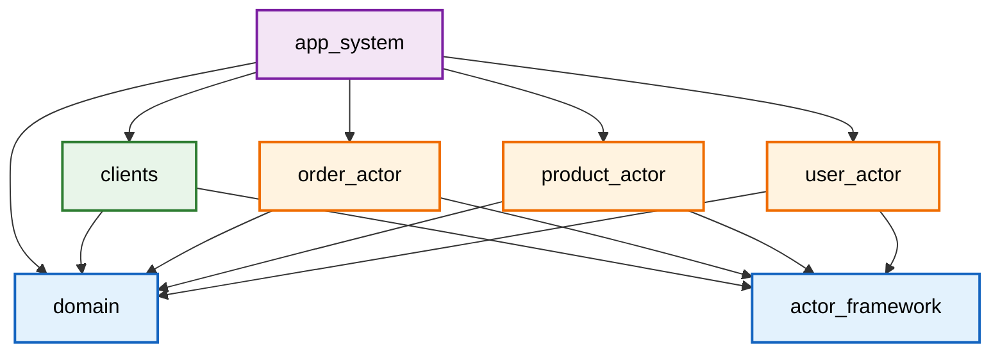

# Architecture Dependency Graph

This diagram visualizes the dependencies between the modules in the `actor-recipe` project after the domain layer refactoring.

```mermaid
graph TD
    %% Styling
    classDef base fill:#e3f2fd,stroke:#1565c0,stroke-width:2px,color:#000;
    classDef actor fill:#fff3e0,stroke:#ef6c00,stroke-width:2px,color:#000;
    classDef client fill:#e8f5e9,stroke:#2e7d32,stroke-width:2px,color:#000;
    classDef system fill:#f3e5f5,stroke:#7b1fa2,stroke-width:2px,color:#000;

    %% Base Layers
    AF[actor_framework]:::base
    D[domain]:::base

    %% Actor Implementations (Infrastructure)
    UA[user_actor]:::actor --> D
    UA --> AF
    
    PA[product_actor]:::actor --> D
    PA --> AF
    
    OA[order_actor]:::actor --> D
    OA --> AF
    
    %% Client Layer (Public API)
    C[clients]:::client --> D
    C --> AF
    
    %% Application System (Wiring)
    AS[app_system]:::system --> C
    AS --> D
    AS --> UA
    AS --> PA
    AS --> OA
```
